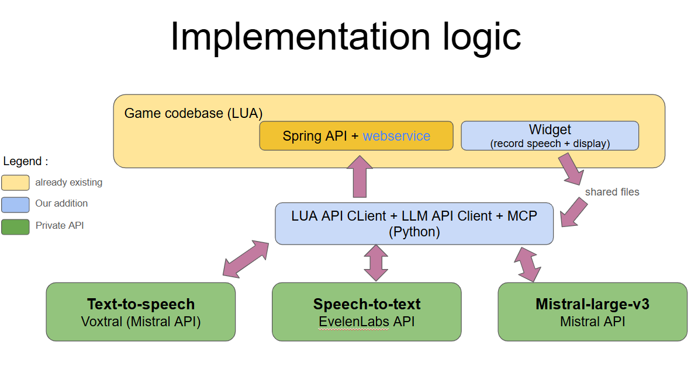

# Beyond-All-Reason (MistralAI Worldwide 03/2026 Hackathon)

## Explaination
### Purpose
This repository has been used during the MistralAI 2026 Hackathon. 
Our idea was to add oral communication with player replacement AIs to improve the gaming experience when playing alone.

### Features added

The features we have added are : 
- Text-to-speech to send orders to your ally (python). (Mistral API key required to use Voxtral)
- a python Agent triggered in a loop or after certain events (python) (Mistral API key required for the Mistral3-large model)
- a MCP server to retrieve game state and take actions of the LLM (python)
- a webservice within the Lua code to execute actions of the LLM (Lua)
- Speech-to-text for the LLM to speak to the player directly. (ElevenLabs API key required)



## How to install

1) Follow the official repo installation process [Here](README_OFFICIAL_REPO.md)

2) Clone this repo instead of the official one in your BAR.SSD path. 

```
git clone --recurse-submodules https://github.com/pierreadorni/Beyond-All-Reason.git BAR.sdd
```

3) Install the Python dependencies
```
uv sync
```
4) Set your API keys for Mistral API and elevenlabs API.
```
export MISTRAL_API_KEY="your_key_here"
export ELEVENLABS_API_KEY="your_key_here"
```

## How to play
1) Start the Agent
```
uv run python ./tools/bar_agent.py
```

2) Launch the game as described in the official repo in dev mode [Here](README_OFFICIAL_REPO.md)

3) Press the key "," when speeking and release it when you are finished


## Demo 

